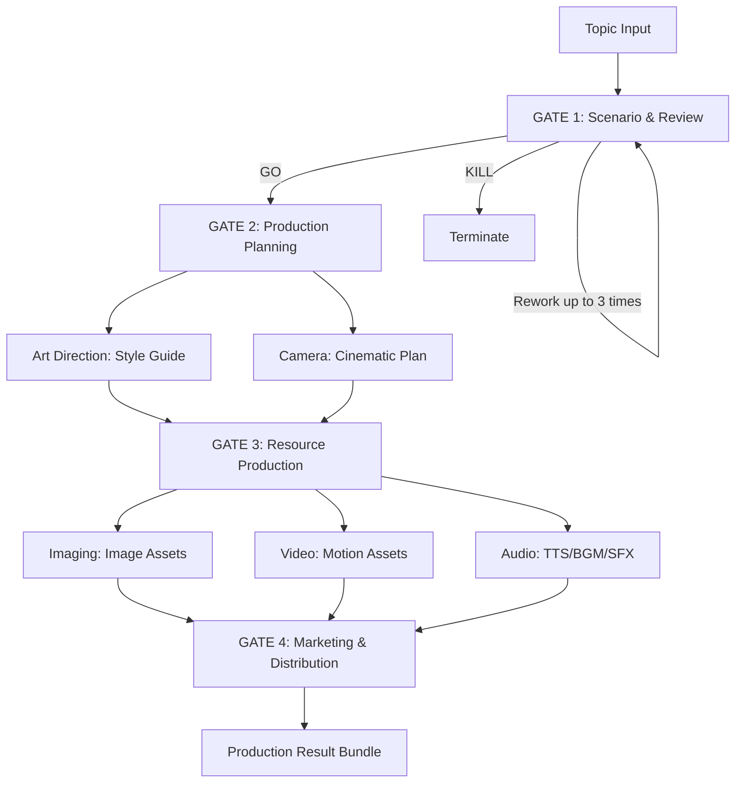

# Murim AI Content Factory 🏯

AI 기술을 활용한 정통무협 유튜브 콘텐츠의 완전 자동화 제작 시스템입니다.

## 🚀 개요
이 프로젝트는 시나리오 작성, 이미지 및 영상 생성, 성우 더빙, 그리고 최종 영상 편집까지의 전 과정을 멀티 에이전트 시스템을 통해 자동화하는 것을 목표로 합니다.

## 🛠 주요 기능
- **멀티 에이전트 파이프라인**: 작가, 비평위원회, 감독 에이전트 간의 협업
- **캐릭터 일관성 유지**: Midjourney --cref 및 --oref 기반 비주얼 생성
- **다국어 자동 확장**: 하나의 대본으로 5개국어 이상의 나레이션 및 자막 자동 생성
- **GATE 검증 시스템**: 제작 단계별 휴먼-인-더-루프(Human-in-the-loop) 품질 검증

## 🏗 System Architecture (4-GATE Pipeline)
시스템은 감독(Director) 에이전트의 주도하에 4단계 품질 검증 및 제작 과정을 거칩니다.



1. **GATE 1: Scenario & Review**: 작가가 시나리오를 집필하고 6인 비평위원회가 평가합니다. 기준 점수 미달 시 최대 3회 자동 수정을 거칩니다.
2. **GATE 2: Production Planning**: 미술 감독과 카메라 감독이 세계관 스타일 가이드 및 장면별 연출 계획을 수립합니다.
3. **GATE 3: Resource Production**: 비주얼(이미징), 모션(비디오), 사운드 에이전트가 연출 계획에 맞춰 리소스를 생성합니다.
4. **GATE 4: Marketing & Distribution**: 마케팅 에이전트가 제목, 요약, 태그 등 배포용 자산을 생성합니다.

## 🤖 Agents
- **Director**: 전체 공정 오케스트레이션 및 시스템 밸런스 유지
- **Writer**: 시나리오 집필 및 자가 수정
- **Council**: 6가지 페르소나를 가진 비평 위원회
- **Imaging**: 프롬프트 엔지니어링 및 일관성 있는 비주얼 생성
- **Video**: 이미지 기반 고퀄리티 모션 영상 생성
- **Audio**: 나레이션(TTS), BGM 작곡, SFX 효과음 생성
- **Camera**: 시네마틱 카메라 기획 및 연출 설계
- **Art Direction**: 세계관 스타일 가이드 및 시각적 정체성 정의
- **Marketing**: SEO 최적화 및 바이럴 마케팅 자산 생성

## 📦 설치 방법
1. 저장소 클론:
   ```bash
   git clone https://github.com/hoonoh57/murim.git
   cd murim
   ```
2. 환경 설정:
   ```bash
   cp .env.example .env
   # .env 파일에 API 키 입력
   ```
3. 라이브러리 설치:
   ```bash
   pip install -r requirements.txt
   ```

## 🎮 실행 방법
```bash
python main.py
```

## 🗺 로드맵
- **Phase 0**: 인프라 및 리포 정리 (완료)
- **Phase 1**: 핵심 에이전트 및 자가 진화 루프 구현 (완료)
- **Phase 2**: 4-GATE 통합 프로덕션 파이프라인 고도화 (진행 중)
- **Phase 3**: 다국어 채널 업로드 및 마케팅 자동화
